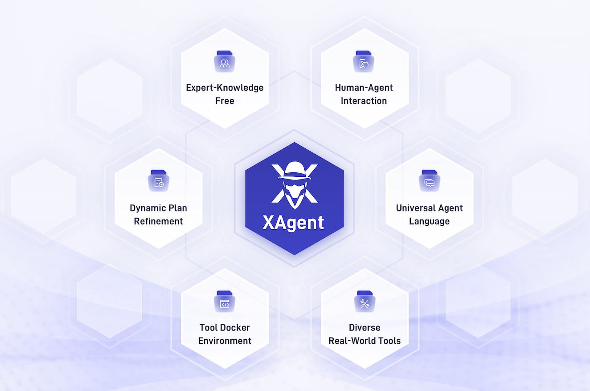

<div align= "center">
    <h1> XAgent</h1>
</div>

<div align="center">

[](https://twitter.com/XAgentTeam) [](https://discord.gg/zncs5aQkWZ) [](https://opensource.org/license/apache-2-0/) 

</div>

<p align="center">
    <a>English</a> •
    <a href="README_ZH.md">中文</a> •
    <a href="README_JA.md">日本語</a>
</p>

<p align="center">
  <a href="#quickstart">Tutorial</a> •
  <a href="https://www.youtube.com/watch?v=QGkpd-tsFPA">Demo</a> •
  <a href="https://blog.x-agent.net/blog/xagent/">Blog</a> •
  <a href="https://xagent-doc.readthedocs.io/en/latest/">Documentation</a> •
  <a href="#Citation">Citation</a>
</p>


## 📖 Introduction

XAgent is an open-source experimental Large Language Model (LLM) driven autonomous agent that can automatically solve various tasks. 
It is designed to be a general-purpose agent that can be applied to a wide range of tasks. XAgent is still in its early stages, and we are working hard to improve it.

🏆 Our goal is to create a super-intelligent agent that can solve any given task!

We welcome diverse forms of collaborations, including full-time and part-time roles and more. If you are interested in the frontiers of agents and want to join us in realizing true autonomous agents, please contact us at xagentteam@gmail.com.

<div align="center">
    
    <br/>
    <figcaption>Overview of XAgent.</figcaption>
</div>

###  XAgent

XAgent is designed with the following features:
- **Autonomy**: XAgent can automatically solve various tasks without human participation.
- **Safety**: XAgent is designed to run safely. All actions are constrained inside a docker container. Run it anyway!
- **Extensibility**: XAgent is designed to be extensible. You can easily add new tools to enhance agent's abilities and even new agents！
- **GUI**: XAgent provides a friendly GUI for users to interact with the agent. You can also use the command line interface to interact with the agent.
- **Cooperation with Human**: XAgent can collaborate with you to tackle tasks. It not only has the capability to follow your guidance in solving complex tasks on the go but it can also seek your assistance when it encounters challenges.

XAgent is composed of three parts:
- **🤖 Dispatcher** is responsible for dynamically instantiating and dispatching tasks to different agents. It allows us to add new agents and improve the agents' abilities.
- **🧐 Planner** is responsible for generating and rectifying plans for tasks. It divides tasks into subtasks and generates milestones for them, allowing agents to solve tasks step by step.
- **🦾 Actor** is responsible for conducting actions to achieve goals and finish subtasks. The actor utilizes various tools to solve subtasks, and it can also collaborate with humans to solve tasks.

<div align="center">
    
    <br/>
    <figcaption>Workflow of XAgent.</figcaption>
</div>

### 🧰 ToolServer

ToolServer is the server that provides XAgent with powerful and safe tools to solve tasks. It is a docker container that provides a safe environment for XAgent to run.
Currently, ToolServer provides the following tools:
- **📝 File Editor** provides a text editing tool to write, read, and modify files.
- **📘 Python Notebook** provides an interactive Python notebook that can run Python code to validate ideas, draw figures, etc.
- **🌏 Web Browser** provides a web browser to search and visit webpages.
- **🖥️ Shell** provides a bash shell tool that can execute any shell commands, even install programs and host services.
- **🧩 Rapid API** provides a tool to retrieve APIs from Rapid API and call them, which offers a wide range of APIs for XAgent to use. See [ToolBench](https://github.com/OpenBMB/ToolBench) to get more information about the Rapid API collections.
You can also easily add new tools to ToolServer to enhance XAgent's abilities.

<div><a id="Quickstart"></a></div>

## ✨ Quickstart

### 🛠️ Build and Setup ToolServer

ToolServer is where XAgent's action takes place. It is a docker container that provides a safe environment for XAgent to run.
So you should install `docker` and `docker-compose` first. 
Then, you need to build the ToolServer image. Construct referring to any one of the following methods:

#### Pull the image from docker hub by running the following command:

```bash
docker compose up
```

#### Build an image from local sources by running the following command:

```bash
docker compose build
docker compose up
```
This will build the image for the ToolServer and start the ToolServer's container. 
If you want to run the container in the background, please use `docker compose up -d`.
Refer [here](ToolServer/README.md) for detailed information about our ToolServer.

If the ToolServer is updated, you have to repull/rebuild the images:
```bash
docker compose pull
```
Or
```bash
docker compose build
```

### 🎮 Setup and Run XAgent

After setting up ToolServer, you can start to run XAgent.
- Install requirements (Require Python >= 3.10)
```bash
pip install -r requirements.txt
```

- Configure XAgent

1. You should configure XAgent in `assets/config.yml` before running it. 
2. At least one OpenAI key is provided in `assets/config.yml`, which is used to access OpenAI API.
We highly recommend using `gpt-4-32k` to run XAgent; `gpt-4` is also OK for most simple tasks.
In any case, at least one `gpt-3.5-turbo-16k` API key should be provided as a backup model.
We do not test or recommend using `gpt-3.5-turbo` to run XAgent due to minimal context length; you should not try to run XAgent on that.
3. If you want to change the config_file path for `XAgentServer`, you should modify the `CONFIG_FILE` value in `.env` file and restart the docker container.


- Run XAgent
```bash
python run.py --task "put your task here" --config-file "assets/config.yml"
```
1. You can use the argument `--upload-files` to select the initial files you want to submit to XAgent.

2. The local workspace for your XAgent is in `local_workspace`, where you can find all the files generated by XAgent throughout the running process. 

3. After execution, the entire `workspace` in `ToolServerNode` will be copied to `running_records` for your convenience.

4. Besides, in `running_records`, you can find all the intermediate steps information, e.g., task statuses, LLM's input-output pairs, used tools, etc.

5. You can load from a record to reproduce a former run, just by setting `record_dir` in config(default to `Null`). The record is a system-level recording tied to the code version of XAgent. All running-config、query、code execution statuses (including errors)、server behavior will be documented.

6. We have removed all sensitive information (including API keys) from the record so you can safely share it with others. In the near future, we will introduce more granular sharing options highlighting the contributions of humans during execution.

   

- Run XAgent with GUI
The container `XAgent-Server` is started with nginx and a web server listening on port `5173`.
You could visit `http://localhost:5173` to interact with XAgent by using web UI.
The default username and password are `guest` and `xagent`, respectively.
Refer [here](XAgentServer/README.md) for the detailed information about our GUI Demo.

<div><a id="Demo"></a></div>

## 🎬 Demo

Here, we also show some cases of solving tasks by XAgent:
You can check our live demo on [XAgent Official Website](https://www.x-agent.net/). We also provide a video demo and showcases of using XAgent here:


### Case 1. Data Analysis: Demonstrating the Effectiveness of Dual-Loop Mechanism

We start with a case of aiding users in intricate data analysis. Here, our user submitted an `iris.zip` file to XAgent, seeking assistance in data analysis. XAgent swiftly broke down the task into four sub-tasks: (1) data inspection and comprehension, (2) verification of the system's Python environment for relevant data analysis libraries, (3) crafting data analysis code for data processing and analysis, and (4) compiling an analytical report based on the Python code's execution results.
Here is a figure drawn by XAgent.


### Case 2. Recommendation: A New Paradigm of Human-Agent Interaction

Empowered with the unique capability to actively seek human assistance and collaborate in problem-solving, XAgent continues to redefine the boundaries of human-agent cooperation. As depicted in the screenshot below, a user sought XAgent's aid in recommending some great restaurants for a friendly gathering yet failed to provide specific details. Recognizing the insufficiency of the provided information, XAgent employed the AskForHumanHelp tool, prompting human intervention to elicit the user's preferred location, budget constraints, culinary preferences, and dietary restrictions. Armed with this valuable feedback, XAgent seamlessly generated tailored restaurant recommendations, ensuring a personalized and satisfying experience for the user and their friends.


### Case 3. Training Model: A Sophisticated Tool User

XAgent not only tackles mundane tasks but also serves as an invaluable aid in complex tasks such as model training. Here, we show a scenario where a user desires to analyze movie reviews and evaluate the public sentiment surrounding particular films. In response, XAgent promptly initiates the process by downloading the IMDB dataset to train a cutting-edge BERT model (see screenshot below), harnessing the power of deep learning. Armed with this trained BERT model, XAgent seamlessly navigates the intricate nuances of movie reviews, offering insightful predictions regarding the public's perception of various films.


### 📊 Evaluation

We conduct human preference evaluation to evaluate XAgent's performance. We prepare [over 50 real-world complex tasks](assets/tasks.yml) for assessment, which can be categorized into 5 classes: Search and Report, Coding and Developing, Data Analysis, Math, and Life Assistant.
We compare the results of XAgent with [AutoGPT](https://github.com/Significant-Gravitas/AutoGPT), which shows a total win of XAgent over AutoGPT. 
All running records can refer to [here](https://drive.google.com/drive/folders/1I-j6FZDyMRrLTpZ64jeN89emA77AbNfc?usp=drive_link).


We report a significant improvement of XAgent over AutoGPT in terms of human preference.

We also evaluate XAgent on the following benchmarks:


<div><a id="Blog"></a></div>

## 🖌️ Blog

Our blog is available at [here](https://blog.x-agent.net/)!

<div><a id="Citation"></a></div>

## 🌟 Our Contributors

A heartfelt thank you to all our contributors. Your efforts make this project grow and thrive. Every contribution, big or small, is invaluable.


## 🌟 Star History

[](https://star-history.com/##openbmb/xagent&Date)

## Citation

If you find our repo useful, please kindly consider citing:
```angular2
@misc{xagent2023,
      title={XAgent: An Autonomous Agent for Complex Task Solving}, 
      author={XAgent Team},
      year={2023},
}
```
