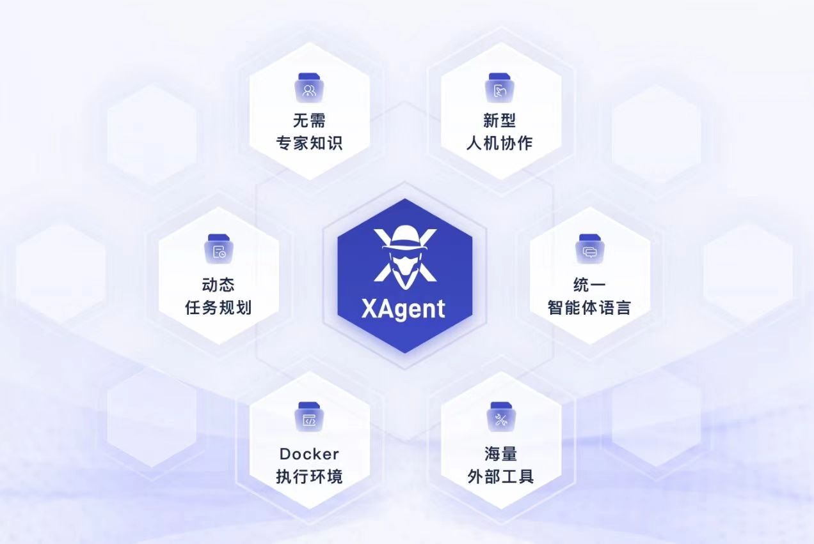
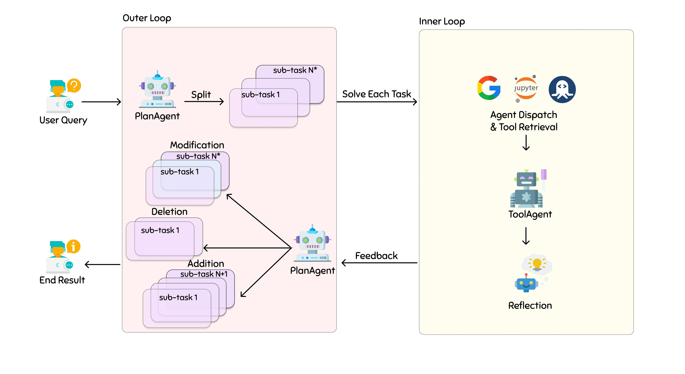
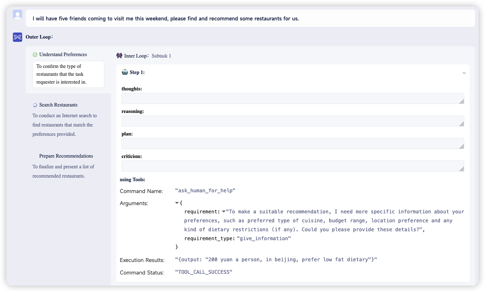
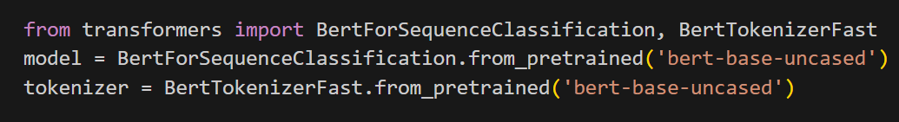
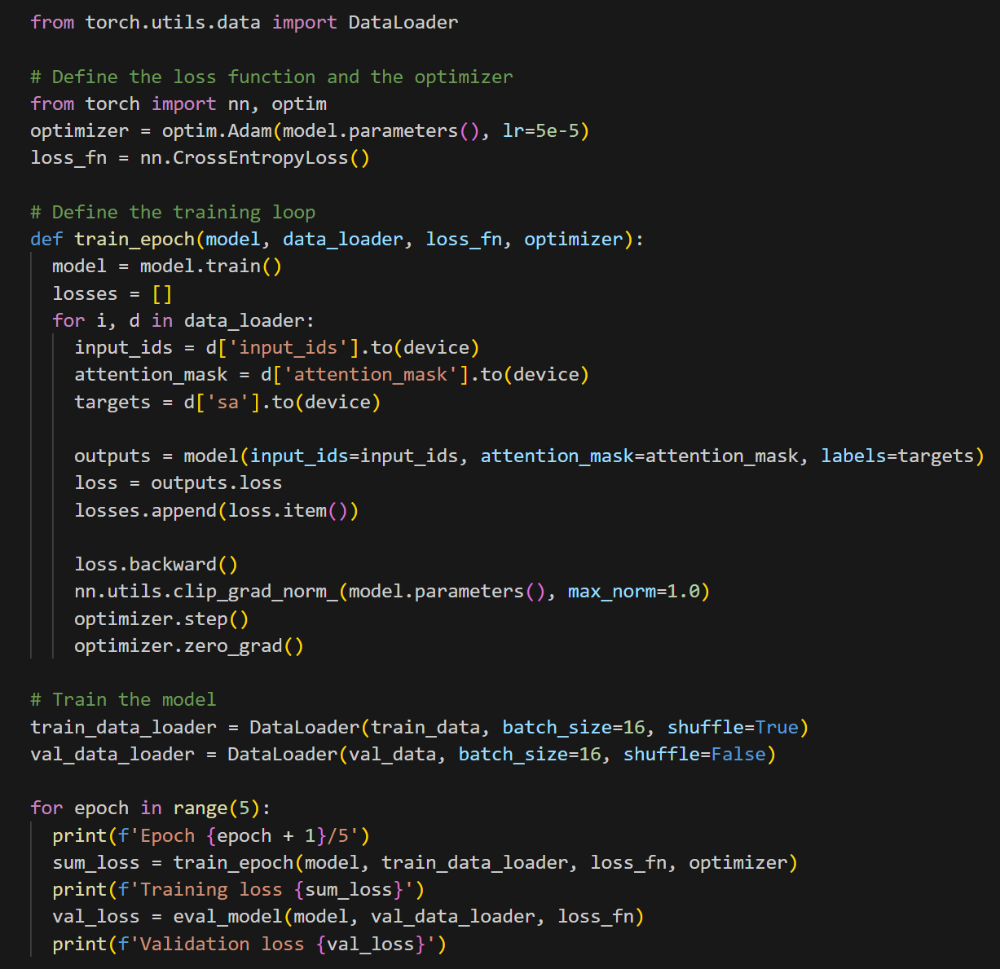
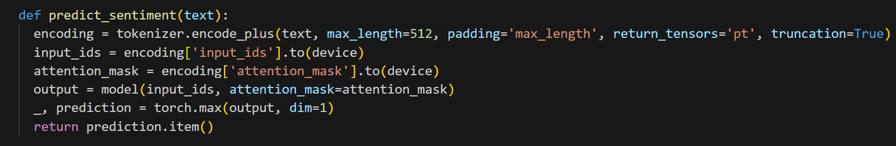
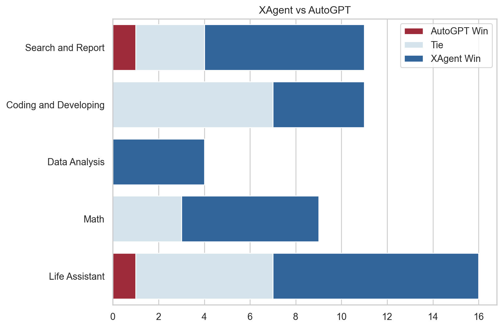
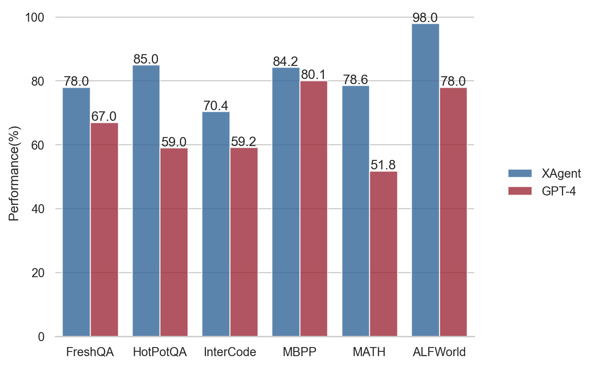

<div align= "center">
    <h1> XAgent</h1>
</div>

<div align="center">

[](https://twitter.com/XAgentTeam) [](https://discord.gg/zncs5aQkWZ) [](https://opensource.org/license/apache-2-0/) 

</div>

<p align="center">
    <a href="README.md">English</a> •
    <a>中文</a> •
    <a href="README_JA.md">日本語</a>
</p>

<p align="center">
  <a href="#Quickstart">教程</a> •
  <a href="https://www.youtube.com/watch?v=QGkpd-tsFPA">演示</a> •
  <a href="https://blog.x-agent.net/blog/xagent/">博客</a> •
  <a href="https://xagent-doc.readthedocs.io/en/latest/">文档</a> •
  <a href="#Citation">引用</a>
</p>


## 📖 介绍

XAgent是一个开源的基于大型语言模型（LLM）的自主智能体，可以自动解决各种任务。
它被设计为一个通用的智能体，可以应用于各种任务。目前，XAgent仍处于早期阶段，我们正在努力改进它。

🏆 我们的目标是创建一个可以解决任何给定任务的超级智能智能体！

我们欢迎各种形式的合作，包括全职、兼职等。如果您对智能体的前沿感兴趣，并希望加入我们实现真正的自主智能体，请通过 xagentteam@gmail.com 与我们联系。

<div align="center">
    
    <br/>
    <figcaption>XAgent功能概览</figcaption>
</div>

###  XAgent

XAgent具有以下特点：
- **自主性**：XAgent可以在没有人类参与的情况下自动解决各种任务。
- **安全性**：XAgent被设计为安全运行。所有的行为都被限制在一个docker容器内。不用担心你的主机环境受到影响
- **可扩展性**：XAgent被设计为可扩展的。您可以轻松地添加新的工具来增强智能体的能力，甚至是新的智能体！
- **GUI**：XAgent为用户提供了友好的GUI来与智能体交互。您也可以使用命令行界面与智能体交互。
- **与人类的合作**：XAgent可以与您合作解决任务。它不仅有能力在行进中遵循您的指导来解决复杂的任务，而且在遇到挑战时还可以寻求您的帮助。

XAgent由三部分组成：
- **🤖 调度器** 负责动态实例化和分派任务给不同的智能体。它允许我们添加新的智能体和改进智能体的能力。
- **🧐 规划器** 负责为任务生成和校正计划。它将任务分解为子任务，并为它们生成里程碑，使智能体能够逐步解决任务。
- **🦾 行动者** 负责采取行动实现目标和完成子任务。行动者利用各种工具来解决子任务，它也可以与人类合作来解决任务。

<div align="center">
    
    <br/>
    <figcaption>XAgent的工作流程图。</figcaption>
</div>

### 🧰 工具服务器

工具服务器是为XAgent提供强大和安全的工具来解决任务的服务器。它是一个docker容器，为XAgent提供一个安全的运行环境。
目前，工具服务器提供以下工具：
- **📝 文件编辑器** 提供一个文本编辑工具，可以写入、读取和修改文件。
- **📘 Python笔记本** 提供一个交互式的Python笔记本，可以运行Python代码来验证想法、绘制图形等。
- **🌏 网页浏览器** 提供一个网页浏览器，可以搜索和访问网页。
- **🖥️ Shell** 提供一个bash shell工具，可以执行任何shell命令，甚至安装程序和托管服务。
- **🧩 Rapid API** 提供一个从Rapid API检索API并调用它们的工具，为XAgent提供了广泛的API。有关Rapid API集合的更多信息，请参见[ToolBench](https://github.com/OpenBMB/ToolBench)。
您也可以轻松地向工具服务器添加新的工具，以增强XAgent的能力。

<div><a id="Quickstart"></a></div>

## ✨ 快速开始

### 🛠️ 构建和设置工具服务器

工具服务器是XAgent的行动发生的地方。它是一个docker容器，为XAgent提供一个安全的运行环境。
因此，您应该首先安装`docker`和`docker-compose`。
然后，您需要构建工具服务器的镜像，参考以下任一方式构建：

#### 从docker hub拉取镜像构建docker网络

```bash
docker compose up
```

#### 从本地源代码构建镜像：

```bash
docker compose build
docker compose up
```

这将构建工具服务器的镜像并启动工具服务器的容器。如果您想在后台运行容器，请相应使用`docker compose up -d`。
参考[ToolServer](ToolServer/README_ZH.md)获取更多信息。

如果需要更新工具服务器或您想重新构建工具服务器的镜像，请使用以下命令：

```bash
docker compose pull
```

或者

```bash
docker compose build
```

### 🎮 配置并运行XAgent

在启动ToolServer后，您可以配置并运行XAgent。
- 安装依赖项：（需要Python版本 >= 3.10）
```bash
pip install -r requirements.txt
```
- 配置XAgent
您需要使用`config.yml`配置XAgent才能运行。
请提供至少一个 OpenAI key，用于访问OpenAI API。
我们建议您配置使用`gpt-4-32k`来使用XAgent，`gpt-4`也可以用于大多数简单的任务。
并且，在任何情况下，至少需要提供一个`gpt-3.5-turbo-16k` API key作为备用模型。
我们不建议您使用`gpt-3.5-turbo`来运行XAgent，因为它的上下文长度非常有限，您不应该尝试在上面运行XAgent。

- 运行XAgent
```bash
python run.py --task "put your task here" --config-file "assets/config.yml"
```
您可以使用参数`--upload-files`来指定提交给XAgent的文件。
您的XAgent的本地工作空间在`local_workspace`中，您可以在运行过程中找到XAgent生成的所有文件。
此外，在`running_records`中，您可以找到所有的中间步骤信息，例如任务状态、LLM的输入输出对、使用的工具等。
在运行结束后，`ToolServerNode`中的完整`worksapce`也将被打包下载到其中。

- 使用GUI运行XAgent
容器`XAgent-Server`内包含一个监听`5173`端口的网页服务器，用于提供XAgent的GUI。
您可以在浏览器中打开`http://localhost:5173`来访问XAgent的GUI。
默认账号和密码是`guest`和`xagent`。
参考[XAgentServer](XAgentServer/README_zh.md)获取更多信息。


<div><a id="Demo"></a></div>

## 🎬 案例

我们提供了一些使用XAgent解决任务的案例：
你可以在[XAgent官网](https://www.x-agent.net/)上查看我们的在线演示。我们还提供了视频演示和使用XAgent的案例：


### 案例1. 数据分析：展示双环机制的有效性

在这个案例中，我们将展示XAgent如何使用双环机制来解决数据分析任务。
我们将使用一个简单的数据集`iris.zip`上传到XAgent，然后让XAgent分析数据集并生成一个报告。
XAgent将任务分解为4个子任务：（1）数据理解，（2）验证Python环境，（3）编写数据分析代码，（4）编写报告。
这里是XAgent绘制的一张图：


### 案例2. 推荐：展示与人类的合作

XAgent拥有独特的能力，可以积极寻求人类协助并共同解决问题，持续重新定义着人类与智能体人合作的界限。如下方截图所示，用户寻求了XAgent的帮助，以推荐一些适合友好聚会的优秀餐厅，但未提供具体细节。识别到提供的信息不足，XAgent利用了“请求人类帮助”工具，促使人类介入以获取用户的偏好位置、预算限制、烹饪偏好以及任何饮食限制。凭借这宝贵的反馈信息，XAgent轻松地生成了定制的餐厅推荐，确保用户及其朋友们获得了个性化和令人满意的体验。



### 案例3. 训练模型：高级工具使用者

XAgent 不仅能处理琐碎任务，还可以在复杂任务中提供宝贵的帮助，比如模型训练。在这里，我们展示了一个用户希望分析电影评论并评估特定电影周围公众情感的情景。作为回应，XAgent 迅速启动了下载 IMDB 数据集的过程，以训练一款先进的 BERT 模型（见下方截图），利用深度学习的强大能力。拥有了这个训练有素的 BERT 模型，XAgent 能够轻松地应对电影评论的复杂细节，提供关于公众对各种电影看法的见解性预测。





### 📊 评测

我们进行了人类偏好评估，以评估XAgent的性能。我们为评估准备了超过50个现实世界的复杂任务，可以分为5个类别：搜索与报告，编码与开发，数据分析，数学和生活助手。

我们将XAgent的结果与[AutoGPT](https://github.com/Significant-Gravitas/AutoGPT)进行比较，结果显示XAgent完全胜过AutoGPT。
我们将很快放出XAgent的运行日志。

我们在人类偏好方面报告了XAgent相对于AutoGPT的显著改进。

此外，我们还在以下基准上对XAgent进行了评估：


<div><a id="Blog"></a></div>

## 🖌️ 博客

我们的官方博客在[这里](https://blog.x-agent.net/)！

## 🌟 我们的贡献者

衷心感谢所有贡献者。你们的努力使得这个项目不断成长和进步。无论大小，每一份贡献都是宝贵的。


## 🌟 星标历史

[](https://star-history.com/##openbmb/xagent&Date)

## 引用

如果您发现我们的仓库对您有帮助，请引用我们的论文：
```angular2
@misc{xagent2023,
      title={XAgent: An Autonomous Agent for Complex Task Solving}, 
      author={XAgent Team},
      year={2023},
}
```
